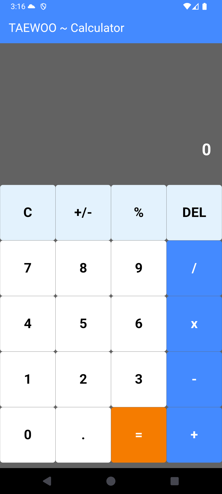
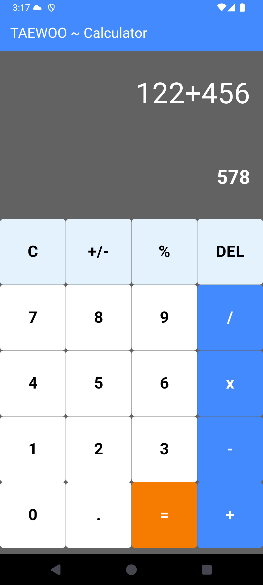
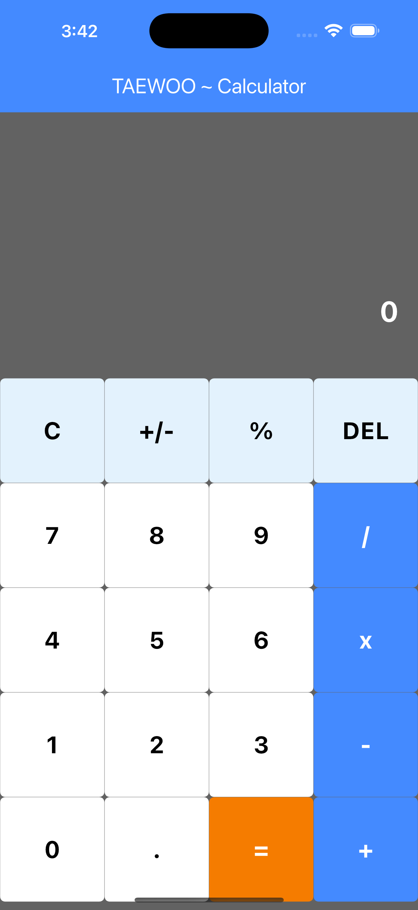
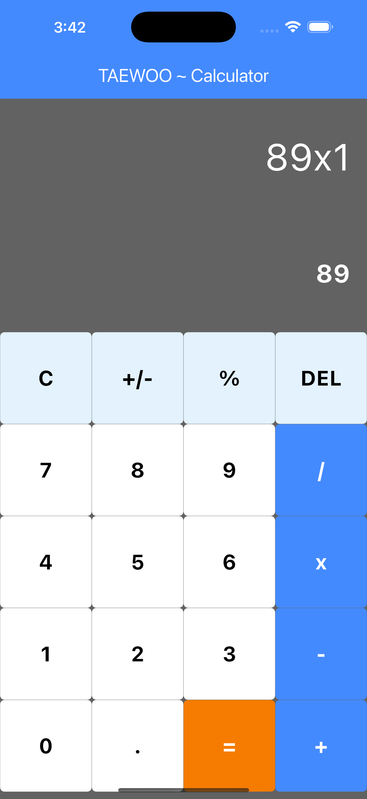

# calculator_example

## 📝 소개
- Flutter를 활용하여 개발한 계산기 애플리케이션입니다. 
- 직관적인 사용자 인터페이스와 다양한 기능을 통해 사용자가 편리하게 계산 작업을 수행할 수 있도록 설계되었습니다.

## 주요 기능
- 사용자의 입력에 따라 실시간으로 계산 결과를 표시합니다.
- 덧셈, 뺄셈, 곱셈, 나눗셈 등의 기본 연산자를 지원합니다.
- 잘못 입력한 내용을 쉽게 삭제하거나 수정할 수 있습니다.
- 사용자 입력의 유효성을 검사하여 오류 메시지를 표시합니다.
- 사용자에게 메시지를 표시하기 위한 토스트 메시지 기능을 제공합니다.
- 계산기 버튼의 종류를 열거형으로 정의하여 관리합니다.
- 계산기 버튼 위젯을 정의하여 UI 구성에 사용합니다.
- 수학 표현식을 파싱하고 계산하는 데 사용됩니다.
- 사용자 입력의 유효성을 검사하는 함수들을 포함합니다.
- 주요 UI와 로직을 담당하는 페이지로, 사용자 입력과 계산 결과를 표시하며, 버튼을 통해 사용자 입력을 처리합니다.
- 애플리케이션의 진입점으로, MyApp 위젯을 정의하고 HomePage를 호출합니다.
- Flutter의 머티리얼 디자인 위젯을 사용하여 UI를 구성합니다.
- 사용자가 편리하게 계산 작업을 수행할 수 있도록 설계되었습니다.

## 파일 구조
- main.dart: 애플리케이션의 진입점으로, MyApp 위젯을 정의하고 HomePage를 호출합니다.
- HomePage.dart: 주요 UI와 로직을 담당하는 페이지로, 사용자 입력과 계산 결과를 표시하며, 버튼을 통해 사용자 입력을 처리합니다.
- CalculatorButton.dart: 계산기 버튼의 종류를 열거형으로 정의하여 관리합니다.
- CheckCondition.dart: 사용자 입력의 유효성을 검사하는 함수들을 포함합니다.
- MyButton.dart: 계산기 버튼 위젯을 정의하여 UI 구성에 사용합니다.
- ToastMessage.dart: 사용자에게 메시지를 표시하기 위한 토스트 메시지 기능을 제공합니다.

## 📸 스크린샷

## 🛠 사용된 패키지

- [flutter/material.dart](https://api.flutter.dev/flutter/material/material-library.html): Flutter의 머티리얼 디자인 위젯을 사용하여 UI를 구성합니다.
- [math_expressions](https://pub.dev/packages/math_expressions): 수학 표현식을 파싱하고 계산하는 데 사용됩니다.

## 🔗 참고 자료

- [Flutter 공식 문서](https://flutter.dev/docs)
- [Flutter로 계산기 앱 만들기 튜토리얼](https://brunch.co.kr/%40yudong/108)